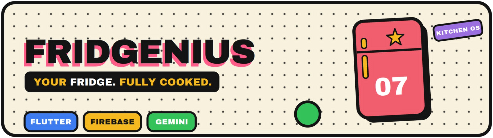

<p align="center">
  
  <br>
</p>

<p align="center">
  
  
  
  
  
</p>

<center><b>Fridgenius! reads the ingredients already sitting in your kitchen and hands back a cooked meal in a single Gemini-powered flow.</b></center>

## Table of Contents

- [About](#about)
- [Features](#features)
- [Screenshots](#screenshots)
- [Tech Stack](#tech-stack)
- [Project Structure](#project-structure)
- [Team](#team-clik)

## About

Home cooks and students often open the fridge to a scattered set of ingredients and no plan for what to make with them. Conventional recipe apps are built around searching for a named dish, which is the wrong entry point when the starting position is a pile of raw ingredients rather than a target meal. The result is a familiar cycle of wasted food, repeat delivery orders, and daily fatigue over a decision that should be simple.

Fridgenius! inverts that flow. A user types in the ingredients they already own, and the Gemini API returns ranked recipe suggestions, listing exact matches first and then recipes that need only one or two additional items, with reasonable substitutions where they apply. Each result is presented as a structured recipe card covering the title, ingredients, steps, estimated cook time, and any missing items. A curated recipe library backs the generation flow as a known-good fallback, and a favorites system lets signed-in users keep the recipes they want to return to. The core generation path requires no account, so a usable recipe is reachable within seconds of opening the app.

By steering meals toward ingredients that are already on hand and close to running out, Fridgenius! supports Sustainable Development Goal 12 on Responsible Consumption and Production through the reduction of household food waste. Its focus on affordable, low-effort home cooking for budget-conscious students and young cooks also supports Sustainable Development Goal 2 on Zero Hunger by improving access to practical, resourceful meal preparation.

## Features

| Feature                  | What It Does                                                                                                                 |
| :----------------------- | :--------------------------------------------------------------------------------------------------------------------------- |
| Ingredient Input         | Accepts a text list of the ingredients a user currently has on hand.                                                         |
| Gemini Recipe Generation | Ranks recipes from the ingredient list, exact matches first, then options needing one or two extra items with substitutions. |
| Recipe Card Display      | Presents each recipe with its title, ingredients, steps, estimated cook time, and a flag for missing items.                  |
| Curated Recipe Library   | Serves a pre-loaded Firestore recipe set as fallback content and initial seed data.                                          |
| Save/Favorites           | Lets users store generated or curated recipes to a personal list for later reference.                                        |

## Screenshots

<!-- Add app screens here -->

## Tech Stack

| Layer                | Technology           |
| :------------------- | :------------------- |
| Frontend Framework   | Flutter              |
| State Management     | Riverpod             |
| Navigation           | GoRouter             |
| Backend and Database | Firebase (Firestore) |
| Authentication       | Firebase Auth        |
| Image Storage        | Firebase Storage     |
| AI Recipe Generation | Gemini API           |

## Project Structure

```
fridgenius/
├── lib/
│   ├── events/         Application events, analytics, or event bus configurations
│   ├── models/         Data classes (recipes, ingredients, profiles)
│   ├── providers/      Riverpod providers holding state and dependency injection
│   ├── repositories/   Data layer handling fetching and backend communication
│   ├── router/         GoRouter navigation configuration
│   ├── services/       Gemini API, Firestore, and Firebase Auth wrappers
│   ├── theme/          App styling, color schemes, and typography
│   ├── utils/          Helper functions, extensions, and utility classes
│   ├── viewmodels/     View-specific state logic and controllers
│   ├── views/          UI screens (built using HookConsumerWidget)
│   ├── widgets/        Reusable UI components and local hook widgets
│   └── main.dart       App entry point
├── assets/             Images and static resources
├── test/               Unit and widget tests
└── pubspec.yaml        Dependencies and asset declarations
```

## Team Clik

- [Justin Ramas (senRyuu286)](https://github.com/senRyuu286)
- [John Anthony Romeo (lemonJAR)](https://github.com/lemonJAR)
- [Joel Franco Navales (JoelNavales)](https://github.com/JoelNavales)
